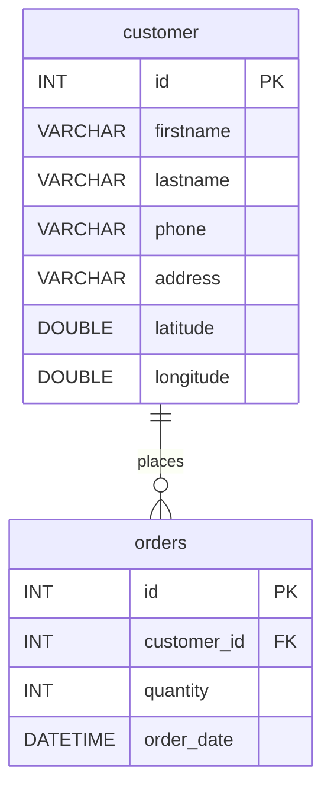

# HW5 – Web API ร้านข้าวกล่องเดลิเวอรี (ส่งด่วนมื้อเที่ยง)

Web API (NodeJS + Express + TypeScript + MySQL) สำหรับโปรเจกต์ **ระบบจัดเส้นทางและแบ่งงานไรเดอร์อัจฉริยะ**
ใช้จัดการ **ลูกค้า** และ **รายการสั่งซื้อ** ตามโจทย์ HW-5

> เขียนตามบทเรียน `NodeJS Web API (TS)` ทั้งหมด (Express Router, `req.params` / `req.query` / `req.body`,
> `res.status().json()`, `mysql2` Connection Pool, Model Interface, Spread Merge, CORS, Deploy บน Render)

---

## 1. เช็กลิสต์ตามโจทย์

| ข้อในโจทย์ | ทำที่ไหน |
|---|---|
| 1. ER Diagram | [`docs/er-diagram.png`](docs/er-diagram.png) และหัวข้อ [ER Diagram](#3-er-diagram) (วาดซ้ำใน erdplus.com ตามตาราง) |
| 2.1 เพิ่ม ลบ แก้ไข แสดงข้อมูลลูกค้าทุกคน | `POST` / `DELETE` / `PUT` / `GET /customer` |
| 2.2 ค้นหาจากส่วนหนึ่งของชื่อ, นามสกุล | `GET /customer/search?firstname=...&lastname=...` |
| 2.3 ลูกค้าทั้งหมดในระยะ 1 กม. จากพิกัดที่กำหนด | `GET /customer/nearby?lat=...&lng=...` |
| 3.1 จำลองออเดอร์ 20-30 รายการ (มีข้อมูลลูกค้า + จำนวนกล่อง) | `POST /order/simulate` และ `GET /order` (JOIN ข้อมูลลูกค้ามาให้) |
| 3.1.3 เพิ่ม ลบ แก้ไขจำนวนกล่อง | `POST /order`, `DELETE /order/:id`, `PUT /order/:id` |
| 3.2 ล้าง (ลบทั้งหมด) รายการสั่งซื้อ | `DELETE /order` |
| 3.3 ออเดอร์ทั้งหมดในระยะ 2 กม. จากพิกัดที่กำหนด | `GET /order/nearby?lat=...&lng=...` |
| 4. Deploy ให้ทดสอบผ่านอินเทอร์เน็ต | หัวข้อ [Deploy บน Render](#7-deploy-บน-render) |

กติกาจากโจทย์โปรเจกต์ที่ใส่ไว้ในโค้ด:
- ออเดอร์ 1 รายการ สั่งได้ **1-3 กล่อง** (ถ้าส่งนอกช่วงนี้จะได้ `400`)
- จำลองออเดอร์ได้ครั้งละ **20-30 รายการ** ลูกค้าและจำนวนกล่องถูกสุ่ม
- ลูกค้าตัวอย่าง 30 คน อยู่รอบมหาวิทยาลัยมหาสารคาม ในระยะไม่เกิน 3 กม.

---

## 2. โครงสร้างโปรเจกต์

```
Angular hw5/
├── server.ts              เปิดพอร์ตเซิร์ฟเวอร์ (บทที่ 01)
├── app.ts                 รวม Router + CORS + express.json() (บทที่ 02, 04, 12)
├── dbconnect.ts           Connection Pool ไปที่ MySQL (บทที่ 06) อ่านค่าจาก .env
├── .env.example           ตัวอย่างไฟล์ .env (ค่าเชื่อมต่อฐานข้อมูล)
├── controller/
│   ├── index.ts           GET /  (เช็กว่าเซิร์ฟเวอร์ทำงาน)
│   ├── customer.ts        API ลูกค้าทั้งหมด
│   └── order.ts           API ออเดอร์ทั้งหมด
├── model/
│   ├── customer.ts        Interface ของลูกค้า (บทที่ 07.01)
│   └── order.ts           Interface ของออเดอร์
├── utils/
│   └── distance.ts        ฟังก์ชันคำนวณระยะทาง (กม.) ระหว่าง 2 พิกัด
├── database/
│   ├── lunchbox.sql       สร้างตาราง + ลูกค้าตัวอย่าง 30 คน
│   └── setup.ts           สคริปต์รัน lunchbox.sql ให้อัตโนมัติ (npm run setup-db)
├── docs/er-diagram.png    รูป ER Diagram
├── postman/               ไฟล์ Collection สำหรับ Import เข้า Postman
├── package.json
└── tsconfig.json
```

### การหาระยะทาง (ข้อ 2.3 และ 3.3) ทำงานอย่างไร
1. ดึงข้อมูลจากฐานข้อมูลมาทั้งหมด (`SELECT`)
2. ใช้ `map` คำนวณระยะจากพิกัดที่ส่งมา ถึงพิกัดบ้านลูกค้า ด้วยฟังก์ชัน `getDistanceKm()` (สูตร Haversine) แล้วแนบ `distance_km` ไปกับข้อมูล
3. ใช้ `filter` เก็บเฉพาะรายการที่ `distance_km` ไม่เกิน 1 กม. (ลูกค้า) หรือ 2 กม. (ออเดอร์)

---

## 3. ER Diagram




**วาดใน [erdplus.com](https://erdplus.com/)** (โจทย์ให้ใช้เว็บนี้): สร้าง Entity 2 ตัวตามตารางด้านบน
→ ตั้ง `id` เป็น Primary Key ทั้งคู่ → ลาก Relationship ชื่อ `places` จาก `customer` (1) ไป `orders` (Many)
→ Export เป็นรูปไปใส่ใน PDF

ความสัมพันธ์: ลูกค้า 1 คน มีได้หลายออเดอร์ (`orders.customer_id` → `customer.id`)
ถ้าลบลูกค้า ออเดอร์ของลูกค้าคนนั้นจะถูกลบตามไปด้วย (`ON DELETE CASCADE`)

---

## 4. วิธีติดตั้งและรันในเครื่อง

ฐานข้อมูลใช้ **MySQL บน [aiven.io](https://aiven.io/)** (ฟรี ไม่ต้องลงโปรแกรมในเครื่อง และใช้ตัวเดียวกันตอน Deploy ได้เลย)

### 4.1 สร้างฐานข้อมูลบน aiven
1. สมัคร / Login ที่ https://console.aiven.io
2. กด **Create service** → เลือก **MySQL** → เลือกแพลน **Free** → กด Create แล้วรอจนสถานะเป็น **Running**
3. ในหน้า **Overview** ของ service จดค่าเหล่านี้ไว้: **Host, Port, User, Password, Database name** (ปกติ User คือ `avnadmin`, Database คือ `defaultdb`)

### 4.2 สร้างตารางและข้อมูลตัวอย่าง
**วิธีที่ง่ายที่สุด** (หลังทำข้อ 4.3 และ `npm install` แล้ว) รันคำสั่งนี้ครั้งเดียว:
```shell
npm run setup-db
```
ขึ้น `สร้างตารางสำเร็จ มีลูกค้าทั้งหมด 30 คน` ก็เรียบร้อย (คำสั่งนี้จะลบตารางเดิมแล้วสร้างใหม่ทุกครั้ง)

**หรือ** ใช้ extension Database Client ใน VS Code ตามบทเรียน:
1. ใน VS Code ลง extension **Database Client** (database-client.com)
2. กดไอคอน Database ทางซ้าย → **Create Connection** → เลือก **MySQL** → ใส่ Host / Port / User / Password จาก aiven
   และเปิด **SSL** → กด **Connect**
3. เปิดไฟล์ `database/lunchbox.sql` → เลือกฐานข้อมูล `defaultdb` → กด **Run** (หรือคลิกขวาที่ `defaultdb` → Import SQL แล้วเลือกไฟล์นี้)
4. จะได้ตาราง `customer` (ลูกค้า 30 คน) และตาราง `orders` (ว่าง รอจำลองออเดอร์)

### 4.3 ตั้งค่าการเชื่อมต่อในไฟล์ `.env`
คัดลอกไฟล์ `.env.example` เป็นชื่อ `.env` แล้วใส่ค่าจากหน้า Overview ของ aiven

```
DB_HOST=mysql-xxxx.aivencloud.com
DB_PORT=12345
DB_USER=avnadmin
DB_PASSWORD=รหัสผ่านจาก aiven
DB_NAME=defaultdb
```

`dbconnect.ts` จะอ่านค่าจากไฟล์นี้เอง ไฟล์ `.env` อยู่ใน `.gitignore` แล้ว จึงไม่ถูกอัปขึ้น GitHub (รหัสผ่านไม่หลุด)
ตอน Deploy บน Render ให้ใส่ค่าเดียวกันนี้ใน Environment Variables แทน

### 4.4 ติดตั้งแพ็กเกจและรัน
```shell
npm install
npm run dev
```
เห็นข้อความ `Server is started on port 3000` แล้วเปิด http://localhost:3000 จะเจอ `Lunchbox Web API is running`

| คำสั่ง | ทำอะไร |
|---|---|
| `npm run setup-db` | สร้างตาราง + ลูกค้าตัวอย่างในฐานข้อมูล (รันครั้งแรกครั้งเดียว) |
| `npm run dev` | รันแบบพัฒนา (ts-node-dev รีสตาร์ตให้เองเวลากดเซฟ) |
| `npm run build` | คอมไพล์ TypeScript เป็น JavaScript ลงโฟลเดอร์ `dist` |
| `npm start` | รันเวอร์ชันที่คอมไพล์แล้ว (`node dist/server.js`) |

---

## 5. คู่มือการใช้งาน API ทุกเส้น

Base URL ในเครื่อง: `http://localhost:3000` (หลัง Deploy เปลี่ยนเป็น URL ของ Render)
ทุกเส้นที่ส่ง Body ต้องตั้ง Header `Content-Type: application/json`

### สรุปทุกเส้น

| # | Method | Path | ใช้ทำอะไร |
|---|---|---|---|
| 1 | GET | `/customer` | แสดงลูกค้าทุกคน |
| 2 | GET | `/customer/:id` | แสดงลูกค้า 1 คน |
| 3 | GET | `/customer/search?firstname=&lastname=` | ค้นหาจากส่วนหนึ่งของชื่อ/นามสกุล |
| 4 | GET | `/customer/nearby?lat=&lng=` | ลูกค้าในระยะ 1 กม. |
| 5 | POST | `/customer` | เพิ่มลูกค้า |
| 6 | PUT | `/customer/:id` | แก้ไขลูกค้า |
| 7 | DELETE | `/customer/:id` | ลบลูกค้า |
| 8 | GET | `/order` | แสดงออเดอร์ทั้งหมด + ข้อมูลลูกค้า |
| 9 | GET | `/order/:id` | แสดงออเดอร์ 1 รายการ |
| 10 | GET | `/order/nearby?lat=&lng=` | ออเดอร์ในระยะ 2 กม. |
| 11 | POST | `/order/simulate` | จำลองออเดอร์ 20-30 รายการ |
| 12 | POST | `/order` | เพิ่มออเดอร์ |
| 13 | PUT | `/order/:id` | แก้ไขจำนวนกล่อง |
| 14 | DELETE | `/order/:id` | ลบออเดอร์ 1 รายการ |
| 15 | DELETE | `/order` | ล้างออเดอร์ทั้งหมด |

### รหัสสถานะ (Status Code) ที่ใช้
| Code | ความหมาย |
|---|---|
| 200 | สำเร็จ |
| 201 | เพิ่มข้อมูลสำเร็จ |
| 400 | ส่งข้อมูลมาไม่ครบหรือผิดรูปแบบ |
| 404 | ไม่พบข้อมูลตาม id ที่ส่งมา |
| 500 | เซิร์ฟเวอร์/ฐานข้อมูลผิดพลาด |

---

### ลูกค้า (Customer)

#### 1) GET `/customer` – แสดงลูกค้าทุกคน
```
GET http://localhost:3000/customer
```
ผลลัพธ์ `200`
```json
[
  {
    "id": 1,
    "firstname": "สมชาย",
    "lastname": "ใจดี",
    "phone": "0897514212",
    "address": "136/1 หมู่บ้านดอนนา ต.ขามเรียง อ.กันทรวิชัย จ.มหาสารคาม",
    "latitude": 16.245607,
    "longitude": 103.246601
  }
]
```

#### 2) GET `/customer/:id` – แสดงลูกค้า 1 คน
```
GET http://localhost:3000/customer/2
```
ผลลัพธ์ `200` ได้ object ลูกค้า 1 คน / ถ้าไม่พบได้ `404` `{ "error": "Customer not found" }`

#### 3) GET `/customer/search` – ค้นหาจากส่วนหนึ่งของชื่อ, นามสกุล
| Query | ความหมาย |
|---|---|
| `firstname` | ส่วนหนึ่งของชื่อ (ไม่ส่งก็ได้) |
| `lastname` | ส่วนหนึ่งของนามสกุล (ไม่ส่งก็ได้) |

```
GET http://localhost:3000/customer/search?firstname=สม
GET http://localhost:3000/customer/search?lastname=ใจ
GET http://localhost:3000/customer/search?firstname=สม&lastname=ใจ
```
ผลลัพธ์ `200` เป็น array ของลูกค้าที่ตรง (เช่น ค้น `สม` ได้ สมชาย, สมหญิง)

#### 4) GET `/customer/nearby` – ลูกค้าในระยะ 1 กม.
| Query | ความหมาย |
|---|---|
| `lat` | ละติจูดจุดศูนย์กลาง (จำเป็น) |
| `lng` | ลองจิจูดจุดศูนย์กลาง (จำเป็น) |

```
GET http://localhost:3000/customer/nearby?lat=16.2459&lng=103.2525
```
ผลลัพธ์ `200` – มี `distance_km` (ระยะห่างเป็นกิโลเมตร) เพิ่มมาให้ทุกคน
```json
[
  { "id": 1, "firstname": "สมชาย", "lastname": "ใจดี", "...": "...", "distance_km": 0.631 }
]
```
ไม่ส่ง `lat`/`lng` หรือไม่ใช่ตัวเลข → `400` `{ "error": "Please send lat and lng" }`

#### 5) POST `/customer` – เพิ่มลูกค้า
Body (ต้องส่งครบทุกช่อง)
```json
{
  "firstname": "ทดสอบ",
  "lastname": "ระบบ",
  "phone": "0812345678",
  "address": "หอพักหน้ามอ ต.ขามเรียง",
  "latitude": 16.2461,
  "longitude": 103.2519
}
```
ผลลัพธ์ `201`
```json
{ "affected_row": 1, "last_id": 31 }
```
ส่งไม่ครบ → `400` `{ "error": "Please send all customer fields" }`

#### 6) PUT `/customer/:id` – แก้ไขลูกค้า
ส่งมาเฉพาะช่องที่ต้องการแก้ก็ได้ ช่องที่ไม่ส่งจะใช้ค่าเดิม
```
PUT http://localhost:3000/customer/31
```
```json
{ "phone": "0899999999" }
```
ผลลัพธ์ `200` `{ "affected_row": 1 }` / ไม่พบ id → `404`

#### 7) DELETE `/customer/:id` – ลบลูกค้า
```
DELETE http://localhost:3000/customer/31
```
ผลลัพธ์ `200` `{ "affected_row": 1 }` / ไม่พบ id → `404`
*ออเดอร์ของลูกค้าคนนี้จะถูกลบไปด้วย*

---

### รายการสั่งซื้อ (Order)

ข้อมูลออเดอร์ที่ได้จากทุกเส้น `GET` จะมีข้อมูลลูกค้าที่สั่งติดมาด้วย:
```json
{
  "id": 1,
  "customer_id": 14,
  "quantity": 2,
  "order_date": "2026-10-08T04:12:00.000Z",
  "firstname": "อรอุมา",
  "lastname": "ภูมิใจ",
  "phone": "0859148448",
  "address": "97/19 หอพักในมหาวิทยาลัย ต.ขามเรียง อ.กันทรวิชัย จ.มหาสารคาม",
  "latitude": 16.24643,
  "longitude": 103.250214
}
```

#### 8) GET `/order` – แสดงออเดอร์ทั้งหมด
```
GET http://localhost:3000/order
```
ผลลัพธ์ `200` เป็น array ของออเดอร์ (เรียงตาม id)

#### 9) GET `/order/:id` – แสดงออเดอร์ 1 รายการ
```
GET http://localhost:3000/order/1
```
ผลลัพธ์ `200` / ไม่พบ → `404` `{ "error": "Order not found" }`

#### 10) GET `/order/nearby` – ออเดอร์ในระยะ 2 กม.
```
GET http://localhost:3000/order/nearby?lat=16.2459&lng=103.2525
```
ผลลัพธ์ `200` – เหมือนข้อ 8 แต่เหลือเฉพาะออเดอร์ที่บ้านลูกค้าอยู่ไม่เกิน 2 กม. และมี `distance_km` เพิ่มมา
ไม่ส่ง `lat`/`lng` → `400`

#### 11) POST `/order/simulate` – จำลองออเดอร์ 20-30 รายการ
Body (ไม่บังคับ) – ถ้าไม่ส่ง ระบบสุ่มจำนวน 20-30 ให้เอง
```json
{ "amount": 25 }
```
ระบบจะสุ่มลูกค้าจากตาราง `customer` และสุ่มจำนวนกล่อง 1-3 ให้แต่ละออเดอร์
ผลลัพธ์ `201`
```json
{ "created_order": 25, "total_box": 49 }
```
`amount` ไม่อยู่ในช่วง 20-30 → `400` / ยังไม่มีลูกค้าในระบบ → `400`

#### 12) POST `/order` – เพิ่มออเดอร์
```json
{ "customer_id": 1, "quantity": 2 }
```
ผลลัพธ์ `201` `{ "affected_row": 1, "last_id": 47 }`
`quantity` ไม่ใช่ 1-3 → `400` / ไม่มีลูกค้า id นี้ → `404`

#### 13) PUT `/order/:id` – แก้ไขจำนวนกล่อง
```
PUT http://localhost:3000/order/1
```
```json
{ "quantity": 3 }
```
ผลลัพธ์ `200` `{ "affected_row": 1 }` / `quantity` ไม่ใช่ 1-3 → `400` / ไม่พบออเดอร์ → `404`

#### 14) DELETE `/order/:id` – ลบออเดอร์ 1 รายการ
```
DELETE http://localhost:3000/order/1
```
ผลลัพธ์ `200` `{ "affected_row": 1 }` / ไม่พบ → `404`

#### 15) DELETE `/order` – ล้างออเดอร์ทั้งหมด
```
DELETE http://localhost:3000/order
```
ผลลัพธ์ `200` `{ "affected_row": 43 }` (จำนวนออเดอร์ที่ถูกลบ)

---

## 6. ทดสอบด้วย Postman
1. เปิด Postman → **Import** → เลือกไฟล์ `postman/lunchbox-api.postman_collection.json`
2. จะได้ Collection ชื่อ **HW5 Lunchbox Web API** ที่มีครบทั้ง 15 เส้น
3. ตัวแปร `baseUrl` ตั้งไว้เป็น `http://localhost:3000` (แก้เป็น URL ของ Render ตอนทดสอบหลัง Deploy)

ลำดับที่แนะนำ: `GET /customer` → `POST /order/simulate` → `GET /order` → `GET /order/nearby` → `PUT /order/1` → `DELETE /order`

---

## 7. Deploy บน Render
(ตามบทเรียน 14-Deployment)

1. **ฐานข้อมูลออนไลน์** – ใช้ MySQL บน aiven ตัวเดียวกับหัวข้อ 4 ได้เลย
2. **อัปโหลดโค้ดขึ้น GitHub** (ไฟล์ `.gitignore` กันโฟลเดอร์ `node_modules` และ `dist` ไว้แล้ว)
3. ที่ [Render](https://render.com/) → New → Web Service → เลือก repo นี้ แล้วตั้งค่า
   - **Build Command:** `npm install && npx tsc`
   - **Start Command:** `node dist/server.js`
4. แท็บ **Environment** ใส่ค่าฐานข้อมูลจาก aiven

   | Key | ตัวอย่าง |
   |---|---|
   | `DB_HOST` | `mysql-xxxx.aivencloud.com` |
   | `DB_PORT` | `12345` |
   | `DB_USER` | `avnadmin` |
   | `DB_PASSWORD` | (รหัสจาก aiven) |
   | `DB_NAME` | `defaultdb` |

5. รอ Deploy เสร็จ แล้วเปิด URL ที่ Render ให้มา เช่น `https://xxxx.onrender.com/customer`
   ส่ง URL นี้ให้อาจารย์/TA ทดสอบ


---

## 8. สิ่งที่ต้องส่งใน Classroom
- [ ] **ไฟล์ PDF**
  - [ ] ข้อมูลสมาชิกกลุ่มทุกคน (ชื่อ-นามสกุล, รหัสนิสิต)
  - [ ] ER Diagram (วาดจาก erdplus.com หรือใช้ `docs/er-diagram.png`)
  - [ ] คู่มือการใช้งานทุกเส้น API (คัดจากหัวข้อ 5 + ใส่ URL ที่ Deploy แล้ว)
- [ ] **ไฟล์ Zip Source** – Zip ทั้งโฟลเดอร์ **ยกเว้น `node_modules`** (และ `dist`)
