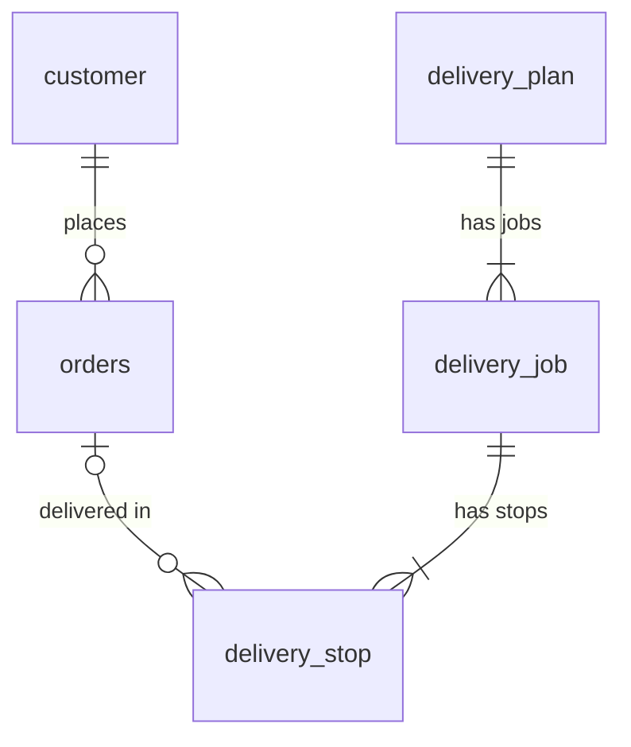

# LunchFlow – ระบบจัดเส้นทางและแบ่งงานไรเดอร์ (ร้านข้าวกล่อง ส่งด่วนมื้อเที่ยง)

เว็บจริงตามโจทย์ **Project.pdf** ต่อยอดจากงาน **HW5 (Web API)**

| ส่วน | เทคโนโลยี | อยู่ที่ |
|---|---|---|
| Backend (Web API) | NodeJS + Express + TypeScript + MySQL (aiven) | โฟลเดอร์หลัก (ราก) |
| Frontend (หน้าเว็บ) | Angular + Tailwind CSS + daisyUI + Leaflet (แผนที่) | โฟลเดอร์ `frontend/` |

- **API ออนไลน์:** https://lunchflow-u723.onrender.com
- **GitHub:** https://github.com/YAJO007/LunchFlow

> เขียนตามบทเรียนในวิชา: Express Router / `req.params` `req.query` `req.body` / `res.status().json()` / mysql2 Pool /
> Angular Component, Data binding (`model()`, `[(ngModel)]`), `@if` `@for`, Router + query params (`input()`),
> Service แชร์ข้อมูล, `fetch` แบบบทเรียน CORS, daisyUI

---

## 1. เช็กลิสต์ตามโจทย์ Project.pdf

**หน้าจอเจ้าของร้าน**
| ความต้องการ | ทำที่ไหน |
|---|---|
| จัดการข้อมูลลูกค้า (ชื่อ เบอร์โทร พิกัดบ้าน) และเห็นบ้านลูกค้าบนแผนที่ | หน้า **ลูกค้า** (`/customers`) – คลิกแผนที่เพื่อเลือกพิกัด |
| จัดการออเดอร์ จำลองออเดอร์ เพิ่ม ลบ แก้จำนวนกล่อง | หน้า **ออเดอร์** (`/orders`) |
| กดปุ่มเดียวแล้วระบบแบ่งงานไรเดอร์ + แผนที่ใหญ่ เส้นทางแยกสีต่อคน (คนที่ 1 แดง, 2 เขียว, 3 น้ำเงิน, ...) | หน้า **จัดเส้นทาง** (`/routes`) ปุ่ม "คำนวณเส้นทาง" |
| ไม่พอใจเส้นทาง กดคำนวณใหม่ให้เสนอเส้นทางอื่น | ปุ่ม "คำนวณใหม่ (แผนถัดไป)" – มีแผนให้เลือกสูงสุด 5 แบบ |
| เห็นค่าใช้จ่าย กำไร/ขาดทุน และเวลาที่ใช้ | การ์ดสรุปด้านบนแผนที่ (ขาดทุนจะขึ้นสีแดงพร้อมคำเตือน) |

**หน้าจอไรเดอร์ (มือถือ)**
| ความต้องการ | ทำที่ไหน |
|---|---|
| กรอกเลขใบงานเพื่อดูใบงานของตัวเอง | หน้า **ใบงานไรเดอร์** (`/rider`) หรือลิงก์ `/rider?job=1001` |
| สรุปง่าย ๆ ต้องหยิบกี่กล่อง ลำดับจุดส่ง 1 → 2 → 3 | การ์ดสรุป + ลำดับจุดส่ง (ชื่อ ที่อยู่ เบอร์โทร เวลาถึง) |
| ปุ่มเปิดแผนที่นำทาง | ปุ่ม "เปิดแผนที่นำทาง" (Google Maps ผ่านทุกจุดตามลำดับ) |

**เงื่อนไขธุรกิจที่ระบบใช้คำนวณ** (แก้ได้ที่ `config/shop.ts`)
| เงื่อนไข | ค่า |
|---|---|
| ราคาขาย / ต้นทุนอาหาร | 65 / 40 บาทต่อกล่อง |
| ค่าไรเดอร์ | 15 บาทต่อรอบ + 2 บาท × จำนวนกล่อง × ระยะทาง (กม.) |
| ไรเดอร์ 1 คน | ไม่เกิน 3 ออเดอร์ |
| ความเร็ว | 30 กม./ชม. (+ ส่งของจุดละ 2 นาที) |
| เวลา | ออกจากร้าน 11:30 ต้องถึงทุกคนไม่เกิน 12:30 |
| ลูกค้า | อยู่รอบมหาวิทยาลัยมหาสารคามในระยะ 3 กม. สั่งได้ 1–3 กล่อง |

**งาน HW5 (Web API)** ยังอยู่ครบ – ดู [คู่มือ API](#8-คู่มือการใช้งาน-api-ทุกเส้น) เส้นที่ 1–15

---

## 2. โครงสร้างโปรเจกต์

```
Angular hw5/   (repo LunchFlow)
├── server.ts / app.ts           เปิดเซิร์ฟเวอร์ + รวม Router + CORS
├── dbconnect.ts                 Connection Pool (อ่านค่าจาก .env)
├── .env.example                 ตัวอย่างไฟล์ .env
├── config/shop.ts               ข้อมูลร้าน + เงื่อนไขคิดเงิน + สีไรเดอร์
├── controller/
│   ├── customer.ts              API ลูกค้า (HW5)
│   ├── order.ts                 API ออเดอร์ (HW5)
│   ├── route.ts                 API จัดเส้นทาง / ยืนยันแผน
│   └── job.ts                   API ใบงานไรเดอร์
├── model/                       Interface ของ customer, order, route
├── utils/
│   ├── distance.ts              คำนวณระยะทางระหว่าง 2 พิกัด
│   └── route-planner.ts         ตัวจัดเส้นทางไรเดอร์ (หัวใจของระบบ)
├── database/
│   ├── lunchbox.sql             สร้างตาราง 5 ตาราง + ลูกค้าตัวอย่าง 30 คน
│   └── setup.ts                 รัน lunchbox.sql ให้อัตโนมัติ (npm run setup-db)
├── docs/er-diagram.png
├── postman/                     Collection สำหรับทดสอบ API
└── frontend/                    เว็บ Angular
    └── src/app/
        ├── app.routes.ts        เส้นทางหน้าเว็บ
        ├── models.ts            โครงสร้างข้อมูล (ตรงกับ API)
        ├── services/api.ts      เรียก API ทุกเส้นด้วย fetch
        ├── utils/map.ts         ฟังก์ชันวาดแผนที่ (Leaflet)
        ├── components/navbar/   แถบเมนู
        └── pages/
            ├── customers/       หน้าจัดการลูกค้า + แผนที่
            ├── orders/          หน้าจัดการออเดอร์
            ├── routes/          หน้าจัดเส้นทาง (แผนที่ใหญ่ + สรุปเงิน)
            └── rider/           หน้าใบงานไรเดอร์ (มือถือ)
```

---

## 3. ระบบจัดเส้นทางทำงานอย่างไร (`utils/route-planner.ts`)

1. **แบ่งออเดอร์เป็นกลุ่ม กลุ่มละไม่เกิน 3 ออเดอร์** (1 กลุ่ม = ไรเดอร์ 1 คน) ลอง 5 วิธี
   - *กวาดรอบร้าน* – เรียงบ้านลูกค้าตามทิศรอบร้านเหมือนเข็มนาฬิกา แล้วตัดทีละ 3 (เริ่มตัด 3 ตำแหน่งต่างกัน = 3 แผน)
   - *จับกลุ่มเพื่อนบ้าน* – เลือกบ้านตั้งต้น (ไกลสุด หรือใกล้สุด) แล้วจับคู่กับ 2 บ้านที่อยู่ใกล้มันที่สุด (= 2 แผน)
2. **เรียงลำดับจุดส่งในกลุ่ม** – ลองทุกลำดับ (3 จุด = 6 แบบ) เลือกแบบที่ระยะทางรวมสั้นที่สุด
3. **คิดเวลาและเงิน** – เวลาถึงแต่ละจุด, ค่าไรเดอร์ = 15 + 2 × กล่อง × กม., ยอดขาย, ต้นทุน, กำไร
4. **เรียงแผน** – แผนที่ส่งทันเวลาทุกคนมาก่อน แล้วเรียงตามค่าส่งจากถูกไปแพง
   แผนที่ 1 = ดีที่สุด, ปุ่ม "คำนวณใหม่" = ดูแผนถัดไป
5. **ยืนยันแผน** – บันทึกลงตาราง `delivery_plan` / `delivery_job` / `delivery_stop` ได้เลขใบงานให้ไรเดอร์

ตัวอย่างผลจริง (ลูกค้าตัวอย่าง 25 ออเดอร์ 49 กล่อง): ใช้ไรเดอร์ 9 คน ระยะรวม 20.5 กม. ค่าส่ง 390 บาท
กำไร 835 บาท ส่งถึงคนสุดท้าย 11:43 (ทันก่อน 12:30)

> **ข้อจำกัด:** ระยะทางคิดแบบเส้นตรงระหว่างพิกัด (ยังไม่ใช่ระยะตามถนนจริง) และนับจากร้านถึงจุดสุดท้าย (ไม่นับขากลับ)

---

## 4. ER Diagram




| ตาราง | เก็บอะไร |
|---|---|
| `customer` | ลูกค้า (ชื่อ เบอร์โทร ที่อยู่ พิกัด) |
| `orders` | ออเดอร์ (ลูกค้าที่สั่ง จำนวนกล่อง 1–3) |
| `delivery_plan` | แผนจัดส่งที่ยืนยันแล้ว + สรุปเงินและเวลา |
| `delivery_job` | ใบงานไรเดอร์ 1 คน (`id` = เลขใบงาน เริ่ม 1001) |
| `delivery_stop` | จุดส่งในใบงาน เรียงตาม `stop_no` (เก็บชื่อ/ที่อยู่ไว้ด้วย ใบงานจะไม่หายแม้ล้างออเดอร์) |

**วาดใน erdplus.com** (ตามโจทย์ HW5): สร้าง Entity 5 ตัวตามตาราง → ลาก Relationship ตามรูป → Export รูปใส่ PDF

---

## 5. วิธีติดตั้งและรันในเครื่อง

### 5.1 ฐานข้อมูล (aiven.io)
1. สร้าง MySQL แบบ Free ที่ https://console.aiven.io แล้วจด Host / Port / User / Password / Database
2. คัดลอก `.env.example` เป็น `.env` แล้วใส่ค่าที่จดไว้
   ```
   DB_HOST=mysql-xxxx.aivencloud.com
   DB_PORT=12345
   DB_USER=avnadmin
   DB_PASSWORD=รหัสผ่านจาก aiven
   DB_NAME=defaultdb
   ```
   ไฟล์ `.env` อยู่ใน `.gitignore` แล้ว รหัสผ่านจึงไม่ถูกอัปขึ้น GitHub

### 5.2 Backend (Web API)
```shell
npm install
npm run setup-db     # สร้างตาราง + ลูกค้าตัวอย่าง 30 คน (ลบข้อมูลเดิมทุกครั้ง)
npm run dev          # http://localhost:3000
```

### 5.3 Frontend (หน้าเว็บ) – เปิด Terminal ใหม่
```shell
cd frontend
npm install
npm start            # เปิด http://localhost:4200 ให้อัตโนมัติ
```
หน้าเว็บที่เปิดจาก `localhost` จะเรียก API ในเครื่อง (`localhost:3000`) อัตโนมัติ
ถ้าเปิดเว็บที่ Deploy แล้ว จะเรียก API บน Render (ตั้งไว้ใน `frontend/src/app/services/api.ts`)

| คำสั่ง (โฟลเดอร์หลัก) | ทำอะไร |
|---|---|
| `npm run setup-db` | สร้างตาราง + ข้อมูลตัวอย่าง |
| `npm run dev` | รัน API แบบพัฒนา |
| `npm run build` / `npm start` | คอมไพล์ / รัน API เวอร์ชันจริง |

| คำสั่ง (`frontend/`) | ทำอะไร |
|---|---|
| `npm start` | รันเว็บแบบพัฒนา |
| `npm run build` | สร้างไฟล์เว็บไว้ Deploy (`frontend/dist/lunchflow-web/browser`) |

---

## 6. วิธีใช้งานหน้าเว็บ (ลำดับที่แนะนำ)

1. **ลูกค้า** – ดูบ้านลูกค้า 30 คนบนแผนที่ / เพิ่มลูกค้า: กรอกชื่อ เบอร์ ที่อยู่ แล้ว **คลิกบนแผนที่** เพื่อเลือกพิกัด
   ค้นหาด้วยชื่อ/นามสกุล หรือคลิกจุดบนแผนที่แล้วกด "ลูกค้าในระยะ 1 กม."
2. **ออเดอร์** – กด "จำลองออเดอร์" (20–30 รายการ) / แก้จำนวนกล่องจาก dropdown ในตาราง / ลบ / ล้างทั้งหมด
3. **จัดเส้นทาง** – กด **คำนวณเส้นทาง** → ดูแผนที่ เส้นทางแต่ละสี เวลา กำไร/ขาดทุน
   - ไม่พอใจ → **คำนวณใหม่ (แผนถัดไป)**
   - กดการ์ดไรเดอร์เพื่อดูเส้นทางเฉพาะคนนั้น
   - พอใจ → **ยืนยันแผนและออกใบงาน** → แต่ละการ์ดจะมี "ใบงาน 10xx"
4. **ใบงานไรเดอร์** – ไรเดอร์เปิดบนมือถือ กรอกเลขใบงาน → เห็นจำนวนกล่อง ลำดับจุดส่ง เบอร์โทร (กดโทรได้) และปุ่ม **เปิดแผนที่นำทาง**

---

## 7. ทดสอบ API ด้วย Postman
Import `postman/lunchbox-api.postman_collection.json` แล้วเปลี่ยนตัวแปร `baseUrl` เป็น `http://localhost:3000` หรือ URL ของ Render

---

## 8. คู่มือการใช้งาน API ทุกเส้น

- **ออนไลน์ (Render):** https://lunchflow-u723.onrender.com
- **ในเครื่อง:** `http://localhost:3000`

> Render แบบฟรีจะหลับเมื่อไม่มีคนใช้ ครั้งแรกที่เปิดอาจรอประมาณ 1 นาที

ทุกเส้นที่ส่ง Body ต้องตั้ง Header `Content-Type: application/json`

### สรุปทุกเส้น

| # | Method | Path | ใช้ทำอะไร |
|---|---|---|---|
| 1 | GET | `/customer` | แสดงลูกค้าทุกคน |
| 2 | GET | `/customer/:id` | แสดงลูกค้า 1 คน |
| 3 | GET | `/customer/search?firstname=&lastname=` | ค้นหาจากส่วนหนึ่งของชื่อ/นามสกุล |
| 4 | GET | `/customer/nearby?lat=&lng=` | ลูกค้าในระยะ 1 กม. |
| 5 | POST | `/customer` | เพิ่มลูกค้า |
| 6 | PUT | `/customer/:id` | แก้ไขลูกค้า |
| 7 | DELETE | `/customer/:id` | ลบลูกค้า |
| 8 | GET | `/order` | แสดงออเดอร์ทั้งหมด + ข้อมูลลูกค้า |
| 9 | GET | `/order/:id` | แสดงออเดอร์ 1 รายการ |
| 10 | GET | `/order/nearby?lat=&lng=` | ออเดอร์ในระยะ 2 กม. |
| 11 | POST | `/order/simulate` | จำลองออเดอร์ 20-30 รายการ |
| 12 | POST | `/order` | เพิ่มออเดอร์ |
| 13 | PUT | `/order/:id` | แก้ไขจำนวนกล่อง |
| 14 | DELETE | `/order/:id` | ลบออเดอร์ 1 รายการ |
| 15 | DELETE | `/order` | ล้างออเดอร์ทั้งหมด |
| 16 | GET | `/route/shop` | ข้อมูลร้านและเงื่อนไขการคิดเงิน |
| 17 | POST | `/route/calculate` | คำนวณเส้นทาง (ยังไม่บันทึก) |
| 18 | POST | `/route/confirm` | ยืนยันแผนและออกใบงาน |
| 19 | GET | `/route/latest` | แผนล่าสุดที่ยืนยันแล้ว |
| 20 | GET | `/job/:id` | ใบงานไรเดอร์ตามเลขใบงาน |

> เส้นที่ 1–15 คืองาน HW5 ส่วนเส้นที่ 16–20 เพิ่มสำหรับเว็บจัดเส้นทาง

### รหัสสถานะ (Status Code) ที่ใช้
| Code | ความหมาย |
|---|---|
| 200 | สำเร็จ |
| 201 | เพิ่มข้อมูลสำเร็จ |
| 400 | ส่งข้อมูลมาไม่ครบหรือผิดรูปแบบ |
| 404 | ไม่พบข้อมูลตาม id ที่ส่งมา |
| 500 | เซิร์ฟเวอร์/ฐานข้อมูลผิดพลาด |

---

### ลูกค้า (Customer)

#### 1) GET `/customer` – แสดงลูกค้าทุกคน
```
GET http://localhost:3000/customer
```
ผลลัพธ์ `200`
```json
[
  {
    "id": 1,
    "firstname": "สมชาย",
    "lastname": "ใจดี",
    "phone": "0897514212",
    "address": "136/1 หมู่บ้านดอนนา ต.ขามเรียง อ.กันทรวิชัย จ.มหาสารคาม",
    "latitude": 16.245607,
    "longitude": 103.246601
  }
]
```

#### 2) GET `/customer/:id` – แสดงลูกค้า 1 คน
```
GET http://localhost:3000/customer/2
```
ผลลัพธ์ `200` ได้ object ลูกค้า 1 คน / ถ้าไม่พบได้ `404` `{ "error": "Customer not found" }`

#### 3) GET `/customer/search` – ค้นหาจากส่วนหนึ่งของชื่อ, นามสกุล
| Query | ความหมาย |
|---|---|
| `firstname` | ส่วนหนึ่งของชื่อ (ไม่ส่งก็ได้) |
| `lastname` | ส่วนหนึ่งของนามสกุล (ไม่ส่งก็ได้) |

```
GET http://localhost:3000/customer/search?firstname=สม
GET http://localhost:3000/customer/search?lastname=ใจ
GET http://localhost:3000/customer/search?firstname=สม&lastname=ใจ
```
ผลลัพธ์ `200` เป็น array ของลูกค้าที่ตรง (เช่น ค้น `สม` ได้ สมชาย, สมหญิง)

#### 4) GET `/customer/nearby` – ลูกค้าในระยะ 1 กม.
| Query | ความหมาย |
|---|---|
| `lat` | ละติจูดจุดศูนย์กลาง (จำเป็น) |
| `lng` | ลองจิจูดจุดศูนย์กลาง (จำเป็น) |

```
GET http://localhost:3000/customer/nearby?lat=16.2459&lng=103.2525
```
ผลลัพธ์ `200` – มี `distance_km` (ระยะห่างเป็นกิโลเมตร) เพิ่มมาให้ทุกคน
```json
[
  { "id": 1, "firstname": "สมชาย", "lastname": "ใจดี", "...": "...", "distance_km": 0.631 }
]
```
ไม่ส่ง `lat`/`lng` หรือไม่ใช่ตัวเลข → `400` `{ "error": "Please send lat and lng" }`

#### 5) POST `/customer` – เพิ่มลูกค้า
Body (ต้องส่งครบทุกช่อง)
```json
{
  "firstname": "ทดสอบ",
  "lastname": "ระบบ",
  "phone": "0812345678",
  "address": "หอพักหน้ามอ ต.ขามเรียง",
  "latitude": 16.2461,
  "longitude": 103.2519
}
```
ผลลัพธ์ `201`
```json
{ "affected_row": 1, "last_id": 31 }
```
ส่งไม่ครบ → `400` `{ "error": "Please send all customer fields" }`

#### 6) PUT `/customer/:id` – แก้ไขลูกค้า
ส่งมาเฉพาะช่องที่ต้องการแก้ก็ได้ ช่องที่ไม่ส่งจะใช้ค่าเดิม
```
PUT http://localhost:3000/customer/31
```
```json
{ "phone": "0899999999" }
```
ผลลัพธ์ `200` `{ "affected_row": 1 }` / ไม่พบ id → `404`

#### 7) DELETE `/customer/:id` – ลบลูกค้า
```
DELETE http://localhost:3000/customer/31
```
ผลลัพธ์ `200` `{ "affected_row": 1 }` / ไม่พบ id → `404`
*ออเดอร์ของลูกค้าคนนี้จะถูกลบไปด้วย*

---

### รายการสั่งซื้อ (Order)

ข้อมูลออเดอร์ที่ได้จากทุกเส้น `GET` จะมีข้อมูลลูกค้าที่สั่งติดมาด้วย:
```json
{
  "id": 1,
  "customer_id": 14,
  "quantity": 2,
  "order_date": "2026-10-08T04:12:00.000Z",
  "firstname": "อรอุมา",
  "lastname": "ภูมิใจ",
  "phone": "0859148448",
  "address": "97/19 หอพักในมหาวิทยาลัย ต.ขามเรียง อ.กันทรวิชัย จ.มหาสารคาม",
  "latitude": 16.24643,
  "longitude": 103.250214
}
```

#### 8) GET `/order` – แสดงออเดอร์ทั้งหมด
```
GET http://localhost:3000/order
```
ผลลัพธ์ `200` เป็น array ของออเดอร์ (เรียงตาม id)

#### 9) GET `/order/:id` – แสดงออเดอร์ 1 รายการ
```
GET http://localhost:3000/order/1
```
ผลลัพธ์ `200` / ไม่พบ → `404` `{ "error": "Order not found" }`

#### 10) GET `/order/nearby` – ออเดอร์ในระยะ 2 กม.
```
GET http://localhost:3000/order/nearby?lat=16.2459&lng=103.2525
```
ผลลัพธ์ `200` – เหมือนข้อ 8 แต่เหลือเฉพาะออเดอร์ที่บ้านลูกค้าอยู่ไม่เกิน 2 กม. และมี `distance_km` เพิ่มมา
ไม่ส่ง `lat`/`lng` → `400`

#### 11) POST `/order/simulate` – จำลองออเดอร์ 20-30 รายการ
Body (ไม่บังคับ) – ถ้าไม่ส่ง ระบบสุ่มจำนวน 20-30 ให้เอง
```json
{ "amount": 25 }
```
ระบบจะสุ่มลูกค้าจากตาราง `customer` และสุ่มจำนวนกล่อง 1-3 ให้แต่ละออเดอร์
ผลลัพธ์ `201`
```json
{ "created_order": 25, "total_box": 49 }
```
`amount` ไม่อยู่ในช่วง 20-30 → `400` / ยังไม่มีลูกค้าในระบบ → `400`

#### 12) POST `/order` – เพิ่มออเดอร์
```json
{ "customer_id": 1, "quantity": 2 }
```
ผลลัพธ์ `201` `{ "affected_row": 1, "last_id": 47 }`
`quantity` ไม่ใช่ 1-3 → `400` / ไม่มีลูกค้า id นี้ → `404`

#### 13) PUT `/order/:id` – แก้ไขจำนวนกล่อง
```
PUT http://localhost:3000/order/1
```
```json
{ "quantity": 3 }
```
ผลลัพธ์ `200` `{ "affected_row": 1 }` / `quantity` ไม่ใช่ 1-3 → `400` / ไม่พบออเดอร์ → `404`

#### 14) DELETE `/order/:id` – ลบออเดอร์ 1 รายการ
```
DELETE http://localhost:3000/order/1
```
ผลลัพธ์ `200` `{ "affected_row": 1 }` / ไม่พบ → `404`

#### 15) DELETE `/order` – ล้างออเดอร์ทั้งหมด
```
DELETE http://localhost:3000/order
```
ผลลัพธ์ `200` `{ "affected_row": 43 }` (จำนวนออเดอร์ที่ถูกลบ)

---

### จัดเส้นทางและใบงาน (Route / Job)

#### 16) GET `/route/shop` – ข้อมูลร้านและเงื่อนไข
ผลลัพธ์ `200`
```json
{
  "name": "ข้าวกล่องเดลิเวอรี ส่งด่วนมื้อเที่ยง",
  "latitude": 16.2459, "longitude": 103.2525,
  "pricePerBox": 65, "foodCostPerBox": 40,
  "riderBaseFee": 15, "riderFeePerKmPerBox": 2,
  "maxOrdersPerRider": 3, "speedKmPerHour": 30, "minutesPerStop": 2,
  "departureTime": "11:30", "deadlineTime": "12:30"
}
```

#### 17) POST `/route/calculate` – คำนวณเส้นทาง
Body (ไม่บังคับ) `{ "option": 0 }` – `0` = แผนที่ดีที่สุด, `1` = แผนสำรองถัดไป, ... (เกินจำนวนแผนจะวนกลับแผนแรก)

ผลลัพธ์ `200` (ย่อ)
```json
{
  "option": 0,
  "total_options": 5,
  "plan": {
    "strategy": "กวาดรอบร้าน (เริ่มตำแหน่งที่ 1)",
    "rider_count": 9, "total_order": 25, "total_box": 49,
    "total_distance_km": 20.53, "delivery_cost": 390.31,
    "revenue": 3185, "food_cost": 1960, "profit": 834.69,
    "departure_time": "11:30", "deadline_time": "12:30",
    "last_arrival_time": "11:43", "all_on_time": true,
    "jobs": [
      {
        "rider_no": 1, "color": "#e11d48", "total_box": 5,
        "distance_km": 3.74, "duration_min": 12, "cost": 52.44,
        "finish_time": "11:42", "on_time": true,
        "map_url": "https://www.google.com/maps/dir/?api=1&...",
        "stops": [
          { "stop_no": 1, "order_id": 25, "customer_name": "ธีรเดช วงศ์ใหญ่", "quantity": 1,
            "distance_from_prev_km": 1.91, "arrival_time": "11:34", "...": "..." }
        ]
      }
    ]
  }
}
```
ยังไม่มีออเดอร์ → `400`

#### 18) POST `/route/confirm` – ยืนยันแผนและออกใบงาน
Body `{ "option": 0 }` (เลขแผนเดียวกับที่ดูอยู่)
ผลลัพธ์ `201` – แผนเหมือนข้อ 17 แต่มี `id` (เลขแผน) และทุกใบงานมี `id` (**เลขใบงาน** เริ่มที่ 1001)

#### 19) GET `/route/latest` – แผนล่าสุดที่ยืนยันแล้ว
ผลลัพธ์ `200` เหมือนข้อ 18 / ยังไม่เคยยืนยันแผน → `404`

#### 20) GET `/job/:id` – ใบงานไรเดอร์
```
GET http://localhost:3000/job/1001
```
ผลลัพธ์ `200` ใบงาน 1 ใบ พร้อมจุดส่งเรียงตามลำดับ และ `map_url` สำหรับเปิดนำทาง / ไม่พบ → `404`


---

## 9. Deploy

### 9.1 Web API บน Render (Web Service)
- Build Command: `npm install && npx tsc` / Start Command: `node dist/server.js`
- Environment Variables: `DB_HOST`, `DB_PORT`, `DB_USER`, `DB_PASSWORD`, `DB_NAME` (ค่าเดียวกับ `.env`)
- ทุกครั้งที่อัปโค้ดใหม่ ให้กด **Manual Deploy → Deploy latest commit** ใน Render

### 9.2 หน้าเว็บบน Render (Static Site)
- New → **Static Site** → repo LunchFlow
- Root Directory: `frontend`
- Build Command: `npm install && npm run build`
- Publish Directory: `dist/lunchflow-web/browser`
- แท็บ **Redirects/Rewrites** เพิ่ม: Source `/*` → Destination `/index.html` → Action **Rewrite**
  (ให้เปิดลิงก์ เช่น `/rider?job=1001` ตรง ๆ ได้)

> Render แบบฟรีจะหลับเมื่อไม่มีคนใช้ ครั้งแรกที่เปิดอาจรอประมาณ 1 นาที

---

## 10. สิ่งที่ต้องส่ง (HW5)
- [ ] **PDF**: สมาชิกกลุ่ม / ER Diagram (erdplus.com) / คู่มือ API ทุกเส้น (หัวข้อ 8) + URL ที่ Deploy
- [ ] **Zip Source**: ไม่เอา `node_modules`, `dist`, `frontend/node_modules`, `frontend/dist`, `.env`
